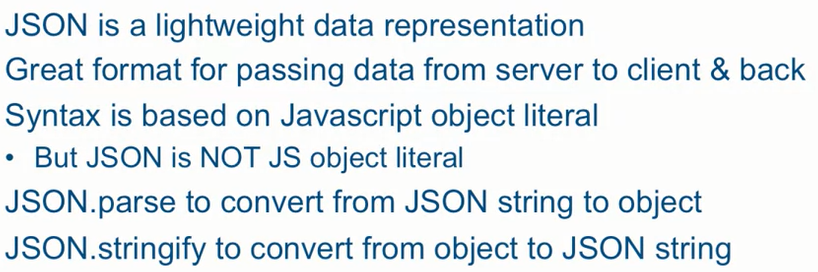

## DOM

When writing web pages and apps, one of the most common things you'll want to do is manipulate the document structure in some way. This is usually done by using the Document Object Model (DOM), a set of APIs for controlling HTML and styling information that makes heavy use of the Document object. In this article we'll look at how to use the DOM in detail, along with some other interesting APIs that can alter your environment in interesting ways.

The DOM on the other hand looks like this:

There are older methods available for grabbing element references, such as:

- **Document.getElementById()**, which selects an element with a given id attribute value

- **Document.getElementsByTagName()**, which returns an array-like object containing all the elements on the page of a given type, for example 
s, <a>s

#### Shortly about JSON and Ajax

JSON is a string, Object Literal is a way of creating a real object in Javascript.

Single quotes are not allowed in JSON.

1. The querySelector method expects a CSS query, so the '#' sign is therefore needed before referencing a value of an 'id' attribute.

2. One of the differences between a GET request and POST is that a GET request passes query parameters as part of the URL whereas POST request passes them as part of the body of the request.

Come back to [README](../README.md)